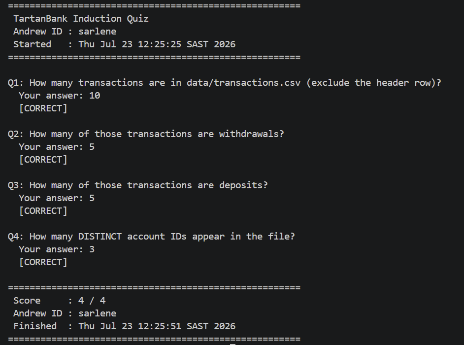

# TartanBank Nightly Operations Toolkit

## Quiz Result

I did the quiz and got a score of 4/4. The screenshot `quiz_result.png` is included in this repository as proof of my result.



## About the Toolkit

In this project, I used Bash for things like creating folders, checking files, running the whole process, and showing a quick summary.
Then I used Python for the bank logic, creating accounts, processing transactions, and generating the report. 
I used Python for these parts because working with classes and data is easier, while Bash is better for connecting different steps together.

## Challenge I Faced

The hardest part for me was understanding how to connect all the different parts into one working tool. 
At first, it was not easy to understand how Bash, Python files, classes, and reports should work together. 
I solved this by working on each part one at a time, testing each file, and then connecting everything after.

## How to Run the Toolkit

To run this project from a fresh clone:

1. Clone the repository:

```bash
git clone https://github.com/saro24/MSIT-WEEK8.git
```

2. Open the project folder:

```bash
cd MSIT-WEEK8
```

3. Make the scripts executable:

```bash
chmod +x setup.sh run.sh secure_creds.sh
```

4. Run the toolkit:

```bash
./run.sh
```

The script will process the transactions and create the report inside the `reports` folder.
